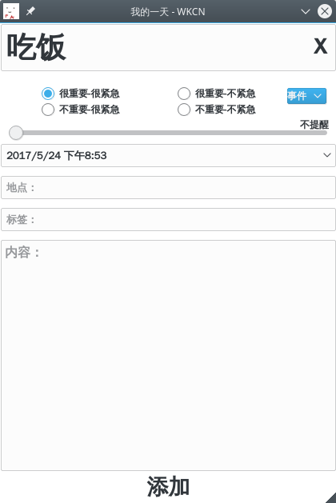
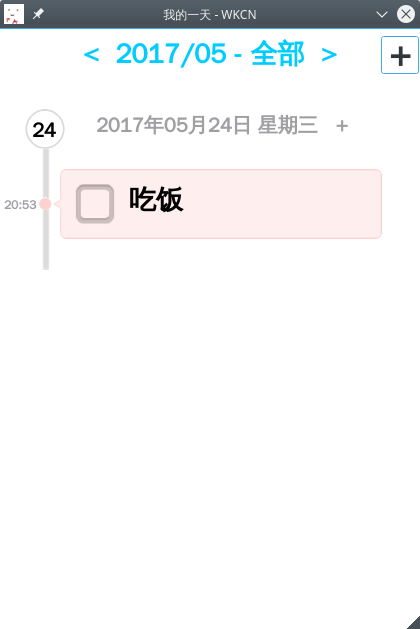
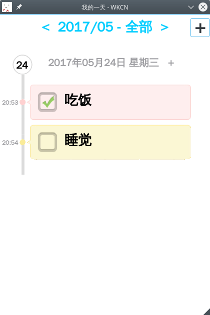
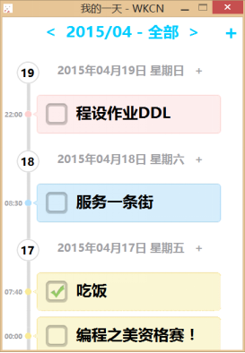

# TodoList - 我的计划表

## 关于
本应用所用图片（除图标外）来自Android APP “高效Todo”

## 效果展示

## 使用方法

添加项目：点击右上角的‘+’号

删除项目：按住左键将项目向右拖动，或者右键双击该项目，支持批量删除

完成项目：点击项目前方的框即可

切换日期：点击上方日期两旁的左右箭头

显示更多：可以按住鼠标然后拖动

切换显示类型：点击上方日期旁的“全部”，可切换到“未完成”和“提示”

## 编译方式

使用Qt编译

支持Windows和Linux
